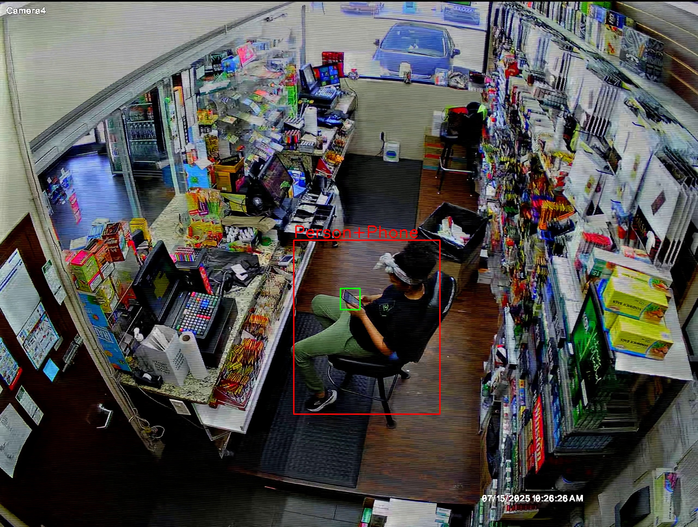

# 📱 Phone Use Detection in Workplace  

This project detects people who use mobile phones during work. It combines **Grounding DINO-tiny** for automatic annotation and **RT-DETR** for object detection, providing a full workflow from dataset preparation to deployment.  

---

## 🚀 Features  
- ✅ Automatic annotation with **Grounding DINO-tiny** (zero-shot labeling).  
- ✅ Training and inference with **RT-DETR**.  
- ✅ Real-time detection from **video files** or **live camera feeds**.  
- ✅ Model optimization: converted trained model to **ONNX (`best.onnx`)** for faster and portable inference. 

---

## 🛠️ Tech Stack  
- **Grounding DINO-tiny** → for automatic annotations.  
- **RT-DETR (Ultralytics)** → for training & detection.  
- **Python 3.10+**, OpenCV, PyTorch, Ultralytics.  

---

## 📸 Example Output  

Here’s an example of detection (`Person+Phone` highlighted in red):  

  

---

## ▶️ How to Run  

### 1️⃣ Clone Repository & Install Requirements
```bash
git clone --filter=blob:none --sparse https://github.com/MohamedSamir72/computer-vision.git
cd computer-vision
git sparse-checkout set Monitoring_of_mobile_phone_usage
```

### 2️⃣ Download Models & Videos
Download the required models and sample videos from Google Drive:
[📂 Download Here](https://drive.google.com/drive/folders/11BeVX8V-LWUuIsmbbhLod77uvQVuGbU2)

Place them inside the project directory like this:
```bash
Monitoring_of_mobile_phone_usage/
│── models/       # Trained models (best.pt, model.onnx)
│── videos/       # Test videos
```

### 3️⃣ Install Requirements
```bash
pip install -r requirements.txt
```

### 4️⃣ Run Detection on Video
```bash
python main.py --source videos/1.mp4
```

### 5️ Run Live Detection (Webcam)
```bash
python main.py --source 0
```

### 6️⃣ Run with Optimized Model (ONNX) [Optional]
```bash
python main.py --model models/best.onnx
```

---

## 📂 Project Structure
```bash
Monitoring_of_mobile_phone_usage/
│── models/
│   ├── best.pt              # Trained RT-DETR model
│   └── best.onnx            # Optimized ONNX model
│
│── videos/                  # Test videos
│── generate_annotations.py  # Generate annotations
│── generate_dataset.py      # Generate dataset from videos
│── main.py                  # Detection script
│── test_model.py            # Test deafult model
│── test_quantized_model.py  # Test optimized model
│── requirements.txt         # Dependencies
└── README.md                # Project documentation
```
